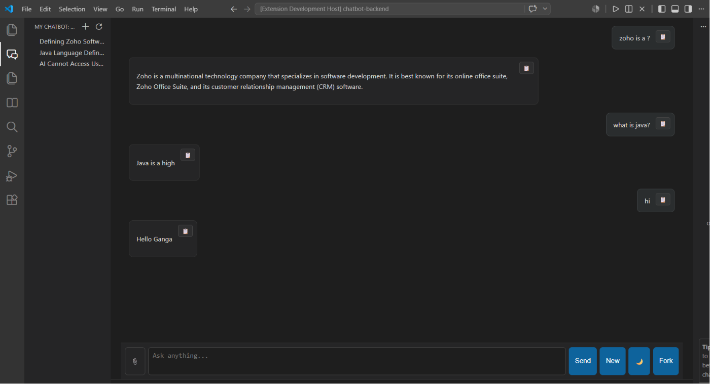

<h1 align="center">
🤖 AI Coding Assistant
</h1>
<p align="center">
An AI-powered VS Code extension developed during my Zoho Summer Internship.
</p>

 📌 Overview

AI Coding Assistant is a modern and intelligent **Visual Studio Code extension** developed during my **Zoho Summer Internship** to enhance the software development experience using **Google Gemini AI**.

The extension brings AI directly into the editor, allowing developers to interact with an intelligent coding assistant without leaving Visual Studio Code. It supports real-time streaming responses, markdown rendering, multiple chat sessions, conversation history, document-based question answering (RAG), and powerful AI tool calling for file operations.

Unlike a traditional chatbot, this assistant understands uploaded documents and workspace files, enabling developers to ask questions about their codebase, edit files using natural language, and manage projects more efficiently—all within a clean and intuitive interface.

The project demonstrates modern AI application development by combining **Gemini AI**, **Retrieval-Augmented Generation (RAG)**, **Vector Search**, **VS Code APIs**, and **intelligent tool execution** into a single productivity-focused extension.
## ✨ What Makes This Project Special?

This project is more than just an AI chatbot. It combines multiple modern AI technologies into one intelligent development assistant.

### 🚀 Key Highlights

- 🤖 AI-powered coding assistant inside Visual Studio Code
- 💬 Multiple chat sessions with conversation history
- ⚡ Real-time streaming AI responses
- 📄 Document understanding using Retrieval-Augmented Generation (RAG)
- 🗂️ Workspace indexing for project-aware responses
- 🛠️ Intelligent AI tool calling for file management
- 📝 Beautiful Markdown and code rendering
- 🔒 Secure API key storage using VS Code Secret Storage
- 🎨 Clean and responsive user interface
- 💾 Local storage for chats and indexed documents

 # 🎯 Problem Statement

Developers often use different tools while coding. They switch between their code editor, AI chatbot, and documentation websites to get help. This takes time and interrupts their workflow.

Most AI chatbots also cannot understand local project files or uploaded documents. Developers have to copy and paste code or text manually, which makes the process slower.

The goal of this project is to solve these problems by bringing AI directly into Visual Studio Code.

# 💡 Solution

AI Coding Assistant is a Visual Studio Code extension that helps developers work faster without leaving their editor.

It allows users to chat with Google Gemini AI, upload documents, search project files, and perform file operations using simple natural language commands.

The extension also supports chat history, multiple chat sessions, document search using RAG, and AI tool calling, making coding easier and more efficient.

# 🌟 Core Features
## 💬 Chat Features

- ✅ Create a new chat
- ✅ Manage multiple chat sessions
- ✅ Switch between chats
- ✅ Save chat history automatically
- ✅ Rename chats
- ✅ Delete chats
- ✅ AI-generated chat titles
- ✅ Recent Chats sidebar
- 
  ## 🤖 AI Features

- ✅ Google Gemini AI integration
- ✅ Real-time streaming responses
- ✅ Conversation memory
- ✅ Markdown rendering
- ✅ Code block rendering

## 📄 Document Features

- ✅ Upload TXT, MD, and PDF files
- ✅ Read PDF content automatically
- ✅ Ask questions about uploaded documents
- ✅ Save document data in LanceDB
- ✅ Search documents using RAG
- ✅ Find relevant information from documents
- ✅ Index workspace files
- ✅ View indexed files
- ✅ Clear indexed data

- ## 🛠️ AI Tool Calling

The AI assistant can perform different file operations using natural language.

- ✅ Read files
- ✅ Write files
- ✅ Append content to files
- ✅ Rename files
- ✅ Delete files
- ✅ Search and replace text using **Levenshtein Distance** and a **Sliding Window** algorithm for accurate matching
- ✅ List workspace files
- ✅ Get the current date and time

- ## 🎨 User Interface

- ✅ Dark theme
- ✅ Copy response button
- ✅ Markdown support
- ✅ Code highlighting
- ✅ Auto-scroll
- ✅ Loading message

## ⌨️ Keyboard Shortcuts

- **Ctrl + K** → Focus the prompt
- **Ctrl + L** → Create a new chat

- ## 💾 Local Storage

- ✅ Save chat sessions locally
- ✅ Store chat history as JSON files
- ✅ Sort recent chats automatically

# 🏗️ Project Architecture


                         👤 User
                            │
                            ▼
                     User Prompt
                            │
            ┌───────────────┼────────────────┐
            │               │                │
            ▼               ▼                ▼
     General Question   Document Query   File Operation
            │               │                │
            ▼               ▼                ▼
      Google Gemini      RAG + LanceDB   AI Tool Calling
            │               │                │
            └───────────────┼────────────────┘
                            ▼
                  Google Gemini AI
                            │
                            ▼
                 Streaming AI Response
                            │
                            ▼
                 Save Chat History (JSON)
                            │
                            ▼
                          👤 User


# 🔄 How It Works

### Step 1: User Enters a Prompt
The user types a question, uploads a document, or requests a file operation in the AI Coding Assistant.

### Step 2: Identify the Request
The assistant checks the user's request and decides whether it is:
- A general question
- A document-related question
- A file operation request

### Step 3: Process the Request
- **General Question:** Sent directly to Google Gemini AI.
- **Document Question:** Searches the uploaded documents using RAG and LanceDB.
- **File Operation:** Uses AI Tool Calling to perform the requested task.

### Step 4: Generate the Response
Google Gemini AI generates a response using the available information from the request, documents, or tool results.

### Step 5: Stream the Response
The response is streamed to the VS Code extension in real time.

### Step 6: Display the Response
The response is shown with Markdown formatting and syntax highlighting for better readability.

### Step 7: Save the Conversation
The chat is automatically saved locally, so users can continue the conversation later.

# 📦 Project Structure

```text
Zoho-Internship-Project
│
├── 📁 History
│   └── ChatHistoryProvider.ts
│
├── 📁 Rag
│   ├── Chunker.ts
│   ├── Embedding.ts
│   ├── Indexer.ts
│   └── VectorStore.ts
│
├── 📁 Src/AI
│   ├── AIService.ts
│   ├── ChatManager.ts
│   ├── Gemini.ts
│   ├── MemoryManager.ts
│   └── TitleGenerator.ts
│
├── 📁 services
│   ├── DistanceCalculator.ts
│   ├── FileExplorer.ts
│   ├── SearchReplace.ts
│   ├── ToolFunctions.ts
│   └── ToolManager.ts
│
├── 📁 webview
│   └── Ui.ts
│
├── 📁 src
│   └── extension.ts
│
├── 📄 package.json
└── 📄 README.md
```

# 🛠️ Technologies Used

| Category | Technology |
|----------|------------|
| **Language** | TypeScript |
| **Runtime** | Node.js |
| **Editor** | Visual Studio Code API |
| **AI Model** | Google Gemini |
| **Vector Database** | LanceDB |
| **RAG** | Retrieval-Augmented Generation (RAG) |
| **Embeddings** | Gemini Embedding Model |
| **Document Parsing** | PDF.js |
| **UI** | HTML, CSS, TypeScript |
| **Storage** | VS Code Secret Storage, Local JSON Files |
| **Search Algorithm** | Levenshtein Distance |
| **Text Matching** | Sliding Window Algorithm |
| **Version Control** | Git & GitHub |

# 🚀 Future Enhancements

* Support multiple AI models
* Voice input and voice responses
* Image understanding
* Web search integration
* Support DOCX, PPTX, and Excel files
* AI code review and debugging
* Cloud synchronization
* Team collaboration
* Multi-language support
* Export chat history
* Improved workspace analysis
* Performance optimization
* Publish on VS Code Marketplace
  
<h1 align="center">📸 Project Screenshot</h1>

<p align="center">
  
</p>

# 👨‍💻 Developed By

**Ganga S**

Developed as part of my **Zoho Summer Internship**.

## 📬 Connect with Me

* **GitHub:** [Ganga-S05](https://github.com/Ganga-S05)
* **LinkedIn:** [Ganga Sukumar](https://www.linkedin.com/in/ganga-sukumar-8b48b1346/)

---

⭐ If you found this project helpful, please consider giving it a **Star** on GitHub.

Thank you for visiting my repository!
